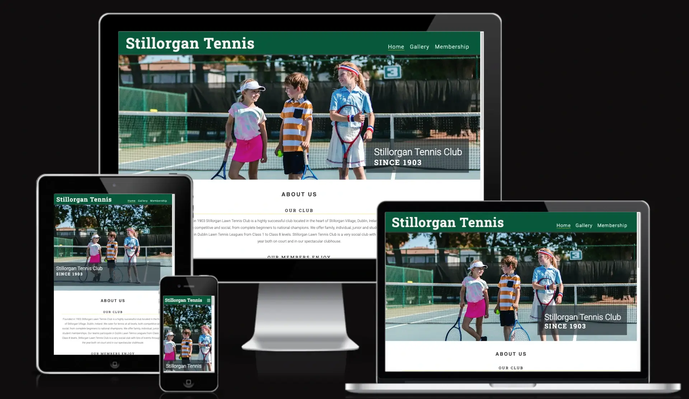
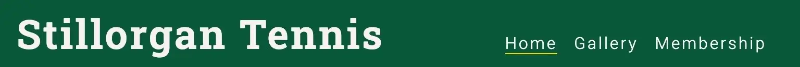
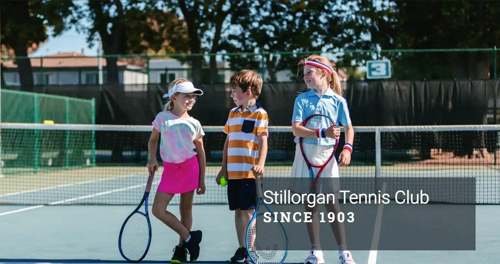
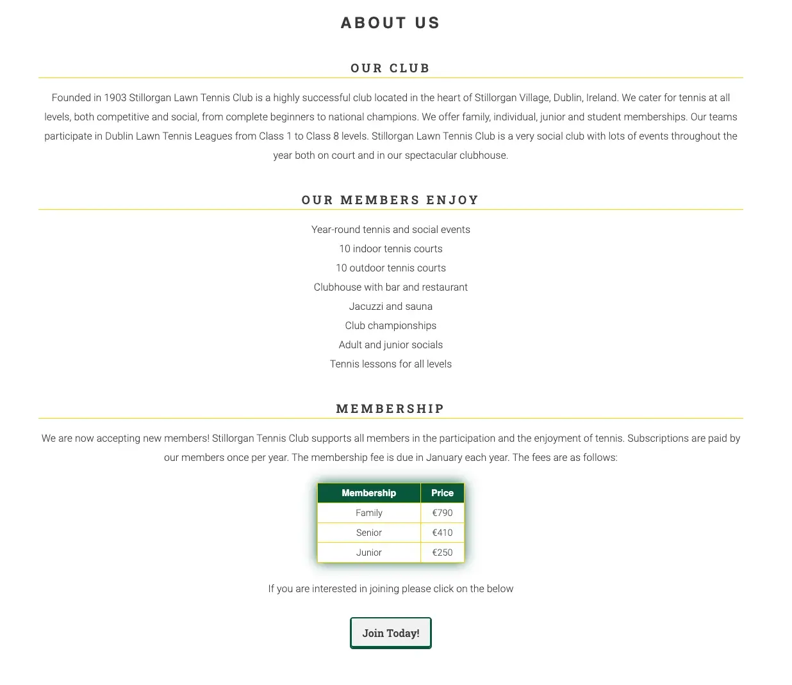
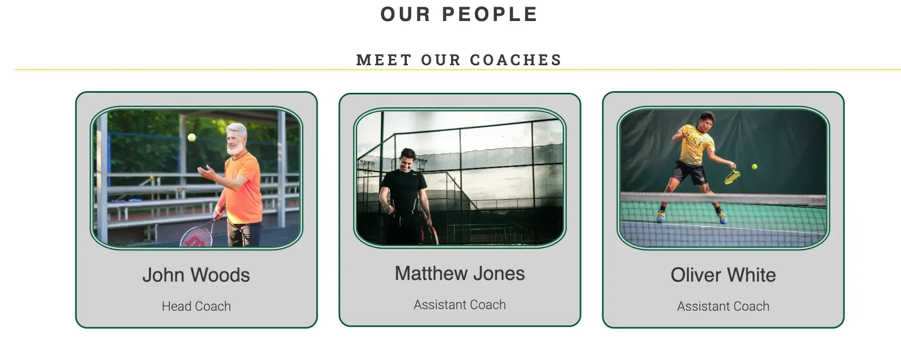
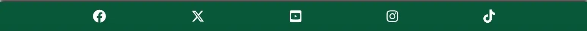
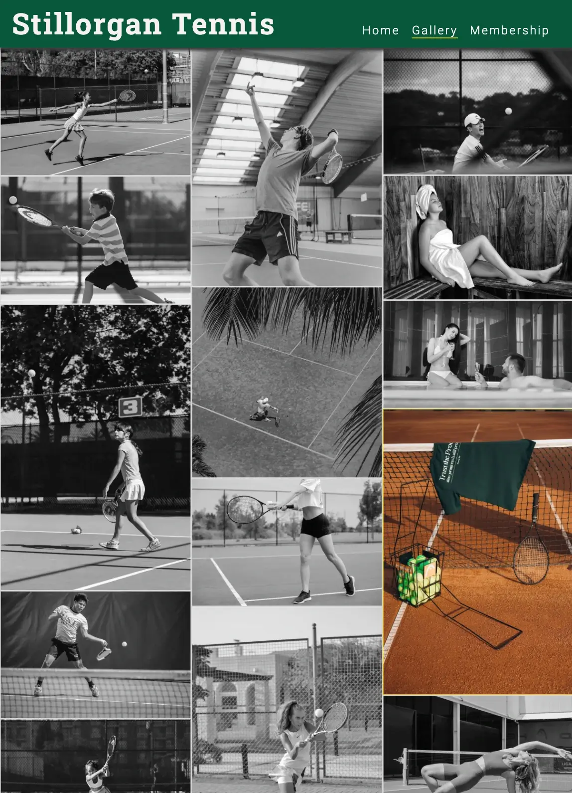
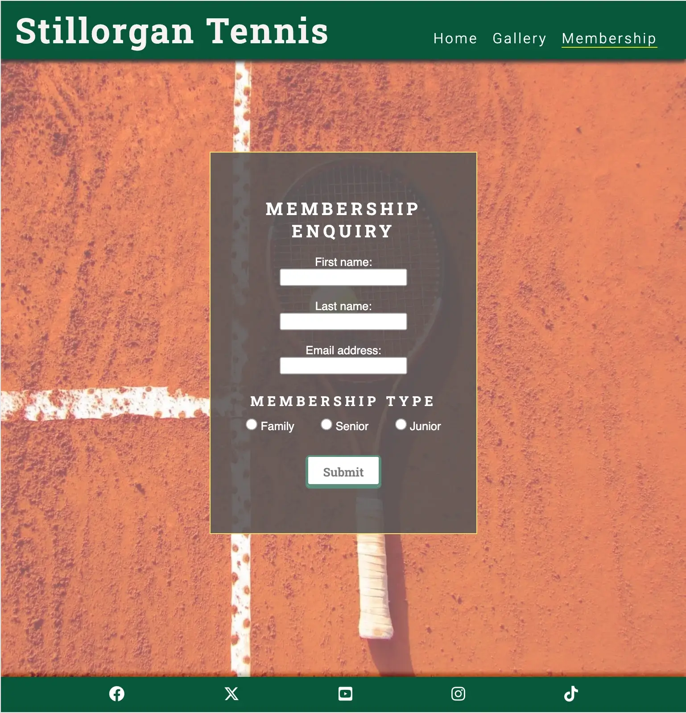
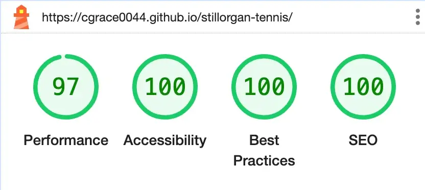

# Stillorgan Tennis

Stillorgan Tennis is a website that aims to provide information about this tennis club located in Stillorgan Village, Dublin, Ireland.

The live link can be found here - [Stillorgan Tennis](https://cgrace0044.github.io/stillorgan-tennis/)

## Site Owner Goals

- To provide the user with information about the club facilities and what the club has to offer.
- To provide the user with some images of the club to get a 'feel' for the club atmosphere.
- To give an overview of the membership prices.
- To enable the user to fill out a form to request more information about the club if they are interested in joining.

## User Stories

### First time user

- As a first time user I want to understand the main purpose of the site and learn what this tennis club has to offer.
- As a first time user I want to be able to intuitively navigate the website and have a positive emotional experience.
- As a first time user I want to be able to get a 'feel' for the tennis club.

### Returning/Frequent User

- As a returning/frequent user I want to be able to request more information about the club via the contact form.

## Design

### Imagery

The imagery used on the Stillorgan Tennis site is very important to the overall experience of the user. The pictures chosen evoke a feeling of happiness from exercising.

### Colours

The colour scheme of the website is predominently white and green with hints of gold. Green was chosen as it is a colour which is regularly associated with tennis as most clubs used to have grass courts. White and green together create a relaxing vibe. The gold accents add an element of luxury to the design.

### Fonts

The Roboto Slab and Roboto fonts are the main fonts used throughout the whole website. These fonts were imported via [Google Fonts](https://fonts.google.com/). I'm using Sans Serif as a backup font, in case for any reason the main font isn't being imported into the site correctly.

## Features

### Navigation

- The navigation bar is positioned at the top of the page.
- It contains the name of the tennis club on the left-hand side. This is clickable and will direct you to the home page.
- On the left hand side there are links to the Home, Gallery and Membership pages.
- The navigation bar is responsive and appears in a form of a hamburger menu on mobile devices.
- The navigation is clear and easy to understand for the user.
- The active page appears with a gold underline in the navigation bar.
  

### The Landing Page Image

- The landing page includes an eye-catching image with a text overlay with the name of the club and when it was founded.
- For smaller screens the text overlay is located on the left-hand-side. On larger screens the text-overlay moves to the right-hand side and the width is reduced to make better use of the space.
- This section provides the user with a clear visual representation of the purpose of the site.

### About Section

- The About Section has three headings: Our Club, Our Members Enjoy and Membership.
- In the Our Club div there is some brief information about the tennis club including the year it was founded, where the club is located, who the club is for and what competitions are on offer.
- The Our Members Enjoy div contains a short list of the club's facilities.
- The Membership div contains information about the membership fees together with a button link to the membership page where the user can request more information.
- The background colour of the button button changes from white to green when clicked. The text changes from black to white when clicked.

### Our People Section

- The 'Our People' Section contains just one heading called 'Meet Our Coaches'. Three cards are displayed with pictures of the coaches and their job titles.
- The number of cards displayed per line depends on the width of the screen. On small screens one card displays per line, on tablets and laptops two cards and on desktops three cards.

### Footer Section

- The footer section includes links to Stillorgan Tennis' Facebook, Twitter, Youtube, Instagram and Tiktok pages.
- The links will open in a new tab to allow easy navigation for the user.
- The links are evenly spaced along the bottom of the screen on all screen-sizes.

### Gallery Page

- Contains images of both children and adults enjoying the club's facilities.
- The images appear in a greyscale format but once clicked/hovered-over they change to colour.
- Each image is surrounded by a gold border to maintain a consistent color-scheme across all pages.
- The gallery page is responsive: there is one column on small screens, two on large or landscape phones, three on tablets and four on desktops and up.

### Membership Page

- The membership page contains a form requesting the users' fullname and email address. It also asks which membership type the user is interested in via checkboxes.
- The form is centered on the page and appears slightly bigger on larger screens.
- The form is surrounded by a neat gold border.
- The submit button changes from white to green when the form is submitted. The text on the button changes from black to white when clicked.

### Features Left to Implement

- In the future I would like to add to the 'Our People' section e.g. name of committee members, coaches profiles etc.
- A more comprehensive contact section with address, telephone number, email address etc
- A section containing upcoming events would also be useful.

## Testing

### Validator Testing

#### HTML

- No errors were returned when passing through the official W3C Markup Validator
- [W3C Validator Results]()

#### CSS

- No errors were found when passing through the official W3C CSS Validator
- [W3C CSS Validator Results]()

#### Accessibility

- The site achieved a Lighthouse accessibility score of 100% which confirms that the colours and fonts chosen are easy to read and accessible

### Form Testing

- The form has been tested to ensure it would not submit without the required input fields being filled in (full name, email address and membership type).
- Once the form is submitted correctly a response page is returned with a congratulations message.

### Links Testing

- All navigation links were tested manually to ensure the user is directed to the correct section of the website.
- Social Media links in the footer of each page were tested manually to ensure they direct the user to the correct page and open in a new tab.

### Browser Testing

- The Website was tested on Google Chrome, Firefox, Brave and Safari browsers with no issues noted.

### Device Testing

- The responsive design was checked using Chrome developer tools across multiple devices with no issues noted.
- I also used the following websites to test responsiveness:
  - [Am I Responsive](https://ui.dev/amiresponsive?url=https://cgrace0044.github.io/stillorgan-tennis)

### Friends and Family User Testing

Friends and family members were asked to review the site to detect any issues.

### Fixed Bugs

#### Poor Accessibility Score on Membership Form

- When running the light-house tool for the Membership page I noticed that the accessibility score was low.
- I change the transparency of the background color so that there would be sufficient contrast between it and the submit button.

#### Poor Performance Score Improved by Compressing Images

- Originally the site had a poor performance score as various image types were used.
- I converted all images to the WEBP file type and I also compressed all the images.
- This dramatically improved the performance score.

### Known Bugs

No known bugs.

## Technologies Used

### Languages

- HTML5
- CSS

### Frameworks - Libraries - Programs Used

- [Am I Responsive](http://ami.responsivedesign.is/) - Used to verify responsiveness of website on different devices.
- [Chrome Dev Tools](https://developer.chrome.com/docs/devtools/) - Used for overall development, including testing responsiveness and performance.
- [Font Awesome](https://fontawesome.com/) - Used for Social Media icons in footer.
- [GitHub](https://github.com/) - Used for version control and hosting.
- [Google Fonts](https://fonts.google.com/) - Used to import and alter fonts on the page.
- [TinyPNG](https://tinypng.com/) - Used to compress images to reduce file size.
- [Convertio](https://convertio.co/) - Used to convert image files from PNG/JPEG to WEBP.
- [Freeconvert](https://www.freeconvert.com/webp-converter) - Used to convert image files from PNG/JPEG to WEBP -ran out of free credits on Convertio.
- [W3C](https://www.w3.org/) - Used for HTML & CSS Validation.

## Deployment

The project was deployed using GitHub pages.

### Content

I drew inspiration from looking at various tennis club sites in Dublin including:

- [Monkstown LTC](https://www.monkstownltc.com)
- [Carrickmines LTC](https://www.carrickmines.com/)
- [Glenageary LTC](https://glenagearyltc.ie/)
- [David Lloyd Riverview](https://www.davidlloyd.ie/clubs/dublin-riverview/)
- [Lansdowne LTC](https://lansdowneltc.com/)

### Media

- All images were sourced from Pexels.
- [Pexels](https://www.pexels.com/)

### Resources Used

- The code used for setting up the page i.e. header, footer and inspiration for the gallery page was taken from the Code Institute Love Running project.
- I watched this video on Youtube as inspiration for the 'Meet Our Coaches' section: [Free Code Camp](https://www.youtube.com/watch?v=OXGznpKZ_sA)
- For clarification on various CSS style rules I used the following website: [W3Schools](https://www.w3schools.com/)
- For various HTML and CSS issues I used the tutorials on the Code Institute Website: [Code Institute](https://learn.codeinstitute.net/)

## Acknowledgments

My mentor Antonio for his support and advice.
